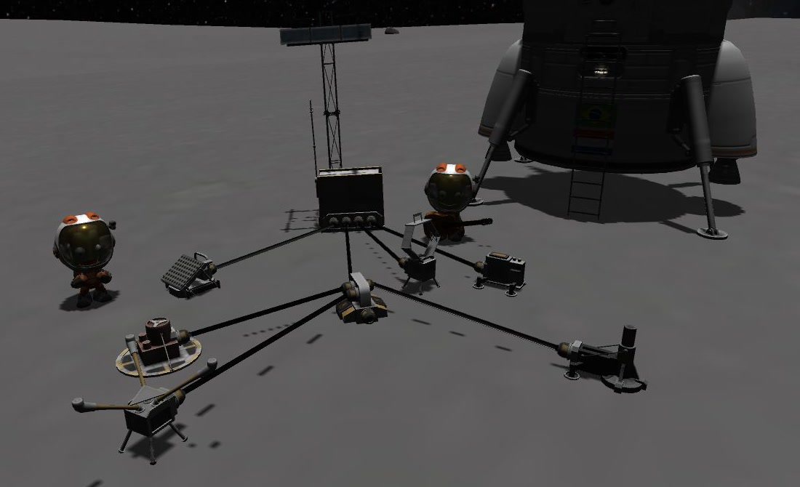
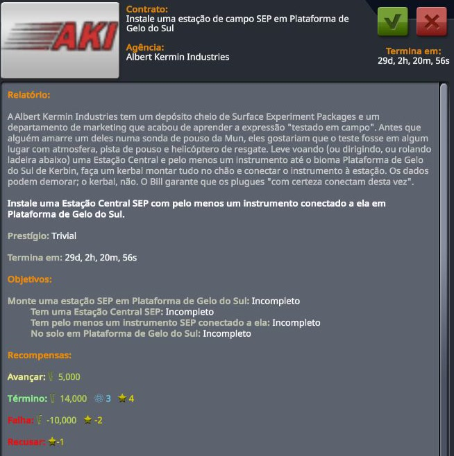

<h1 align="center">Contract Pack: Surface Experiment Package</h1>

<i>Field-tested. Mostly. By Albert Kermin Industries.</i>

  
  
  
  
  
  
  

> *"My grandfather left a box like this on a moon once. Nobody remembers what it measured,
> but we still talk about the invoice."*
> — Albert Kermin, founder of Albert Kermin Industries

[Contract Configurator](https://github.com/KSP-RO/ContractConfigurator) contracts for the
[Surface Experiment Pack](https://github.com/CobaltWolf/Surface-Experiment-Pack) (SEP): set up
science stations on the ground, plug the instruments in, and let them run for months
while you go do something else. Starting in the field behind the KSC and ending, well,
anywhere that will hold still.

## What the brochure promises

- **Only contracts you can actually do.** An instrument is only asked for once its part is
  unlocked and only where SEP lets it run: the Weather Station wants air, the Ion Gauge
  and the Solar Wind Spectrometer want none. Biomes that are mostly water are never picked;
  the station is waterproof, the kerbal is not.
- **A career-long path.** Six tiers of new stations, from a biome of Kerbin to any airless
  rock in the system, plus upgrade contracts that send you back to stations you already
  built.
- **Building, not waiting.** A SEP instrument takes 75–100 days to run, so the contracts pay
  for the station. The data is your bonus when the run finishes.
- **Planet packs welcome.** Tier 4 goes anywhere airless, and the rewards scale with the
  destination, like stock contracts.
- **In English and Brazilian Portuguese,** with the jokes translated, not just the words.

## Contracts

| Tier | Contract | Where | What to set up |
|:---:|---|---|---|
| 0 | **Deploy a SEP field station** | a biome of Kerbin | Central Station + 1 instrument |
| 1 | **Expand the station to two instruments** | a biome of Kerbin | Central Station + 2 instruments |
| 2 | **Plant a SEP station** | the Mun or Minmus | Central Station + 1 instrument |
| 3 | **Forecast the weather** | Duna, Eve or Laythe | Central Station + Weather Station + 1 more |
| 3 | **Listen to the silence** | Ike or Gilly | Central Station + a vacuum instrument + 1 more |
| 4 | **The full package** | any airless world | Central Station + 3 instruments, one of them a vacuum instrument |

**Upgrades** send you back to a station you already built, with its name on the contract:

| Offered after | Contract | The station | Add |
|:---:|---|---|---|
| Tier 1 | **Turn *station* into a research campus** | on Kerbin, 2 instruments | a 3rd instrument |
| Tier 2 | **Go back to *station*** | on the Mun or Minmus, 1 instrument | a 2nd instrument |
| Tier 3 | **A return trip to *station*** | beyond Kerbin's system, 2 instruments | a 3rd instrument |

 
<i>A tier-0 contract in Mission Control, here in Brazilian Portuguese.</i>

Each tier needs the previous one, a landing on the target body, and the right instruments
unlocked. Vacuum instruments are the Cold-Cathode Ion Gauge and the Solar Wind
Spectrometer.

<b>Things you may run into in the contract texts</b> (mild spoilers)

- A family legend about a box left on a moon a long time ago, and the invoice nobody forgot.
- Engineering's position on cables: MOAR instruments still need MOAR cables.
- A hotel on Eve. You can check out any time you like.
- A very serious warning about jumping on Gilly, and what happened to Bob.
- A campus whose cafeteria is a cardboard box (SEP really does ship one).
- A quote about how big space is, and a kerbal who remembered his towel.

## Requirements

- **[Contract Configurator](https://github.com/KSP-RO/ContractConfigurator) 2.13.4 or newer, with
  the updated SEP experiment definitions** from
  [KSP-RO/ContractConfigurator#78](https://github.com/KSP-RO/ContractConfigurator/pull/78) and
  [#79](https://github.com/KSP-RO/ContractConfigurator/pull/79). Until a CC release includes them,
  download
  [`SurfaceExperimentPackage.cfg` from CC's master branch](https://raw.githubusercontent.com/KSP-RO/ContractConfigurator/master/GameData/ContractConfigurator/science/SurfaceExperimentPackage.cfg)
  and copy it over `GameData/ContractConfigurator/science/SurfaceExperimentPackage.cfg`. The file
  in CC 2.13.4 uses experiment ids from 2016, so no SEP experiment is ever "available".
- **Surface Experiment Pack 2.7.x**, **KIS**, **KAS 1.x** and the
  **[SEP-KAS1-Patch](https://github.com/celino/SEP-KAS1-Patch)**, so the plugs can link. A linked
  instrument becomes part of the station's vessel, which is what the contracts check.

## Install

Copy `GameData/ContractPacks/SEPContracts` into your `GameData`. Bill says it "definitely
goes in the right folder this time".

## FAQ

**Why doesn't the contract ask for the science?**
Because a SEP run takes 75–100 days of game time, and nobody wants a contract hanging around
that long. Build the station, collect the reward, and the data arrives later as a bonus.

**My station says it's FLYING. Is that a bug?**
It's KSP. A station attached to the ground with KIS sits a few centimetres above the
terrain and often reloads as "flying". The contracts know, and check the altitude above the
ground instead.

**Does it work with planet packs?**
On paper, yes: tiers 0, 1, 2 and 4 and the upgrades use the home world, its moons and "any
airless body", so they should follow the pack, and the tier-3 contracts are simply not
offered when Duna, Eve, Laythe, Ike or Gilly don't exist. In practice, I have only ever flown
the stock system, so this is untested. If you play OPM, JNSQ, Kcalbeloh or anything else and
plant a SEP station somewhere I've never been, please send a postcard to the forum thread:
a screenshot and your `KSP.log`. Albert Kermin will add your world to the brochure, and I'll
fix whatever broke.

**A kerbal jumped on Gilly and is now in orbit.**
Gilly's escape velocity is about 36 m/s. The contract warned you.

## Localization

All player-facing texts are in `Localization/` (`en-us`, `pt-br`). The contract cfgs call
`Format("#sepc.key", [ ... ])`, so biome, body and station names are passed as `<<1>>`/`<<2>>`.
To add a language, copy `en-us.cfg`, rename the language node and translate the values; the
jokes are part of the job. Every language KSP speaks is welcome. Klingon and Elvish are
welcome too, as long as you have actually negotiated a contract with a Klingon or an Elf;
please include their signature. *Qapla'!* / *Mae govannen!*

## Testing

Every commit is checked automatically. Here on GitHub, the language files must have the same
keys and placeholders as English and the cfgs must be well formed. On my own test machine,
the pack must also load in a real KSP 1.12.5 install with a large modlist, with every contract
loaded by Contract Configurator and no errors mentioning the pack. New contracts are also
played through in a career save before a release.

## How this was made

This pack was written with the help of an AI assistant (Claude). I chose what to build,
reviewed every change and text, and tested each contract in game before release; any
mistakes are mine. Bug reports are welcome on the forum thread or in
[GitHub issues](https://github.com/celino/SEPContracts/issues).

## Credits

- **AlbertKermin** and **CobaltWolf** for the Surface Experiment Pack, and **zer0Kerbal** for
  keeping it alive.
- The **Contract Configurator** team (nightingale, and KSP-RO today) for the framework that makes
  all of this possible.
- The Apollo Lunar Surface Experiments Package, which inspired SEP and, by extension, Albert's
  grandfather.
- **Claudinho** (Claude, my AI assistant), who wrote much of the configs and the first drafts of
  the texts, never asked for coffee, and was wrong about the Solar Wind Spectrometer only once.
  Every line was reviewed and tested by Evandro, who is the one responsible for all of it,
  mistakes included.

## License

[MIT](LICENSE).
